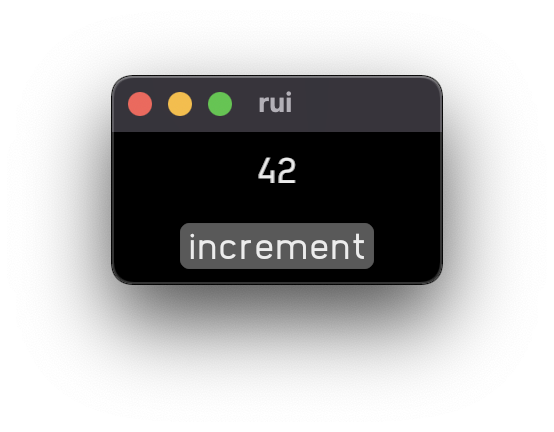
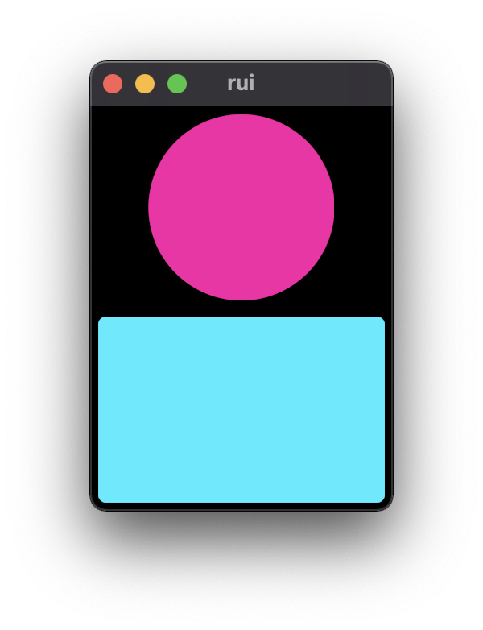
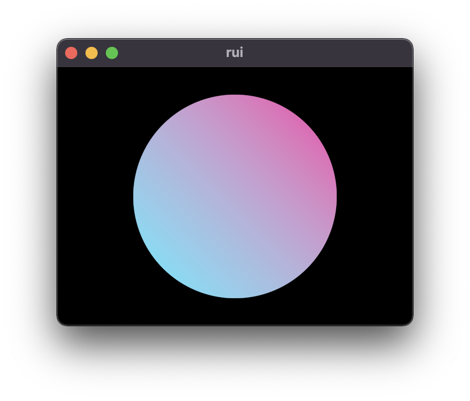

# rui


Experimental Rust UI library, inspired by SwiftUI. "rui" is a temporary name. Early days, but some stuff already works.

rui is immediate mode (there is no retained tree of views), GPU rendered, and has richer layout options than other immediate mode UIs.

obligatory Counter (`cargo run --example counter`):

```Rust
use rui::*;

fn main() {
    rui(state(1, |count: State<usize>| {
        vstack! {
            text(&format!("{:?}", *count.get()))
                .padding(Auto);
            button("increment", move || {
                *count.get() += 1;
            })
                .padding(Auto)
        }
    }));
}
```



some shapes (`cargo run --example shapes`):

```rust
use rui::*;

fn main() {
    rui(vstack! {
        circle()
            .color(RED_HIGHLIGHT)
            .padding(Auto);
        rectangle(5.0)
            .color(AZURE_HIGHLIGHT)
            .padding(Auto)
    });
}
```



canvas for gpu drawing (`cargo run --example shapes`):

```rust
use rui::*;

fn main() {
    rui(hstack! {
        canvas(|rect, vger| {
            vger.save();
            vger.translate(rect.center() - LocalPoint::zero());

            let paint = vger.linear_gradient(
                [-100.0, -100.0].into(),
                [100.0, 100.0].into(),
                AZURE_HIGHLIGHT,
                RED_HIGHLIGHT,
                0.0,
            );

            let radius = 100.0;
            vger.fill_circle(LocalPoint::zero(), radius, paint);
            vger.restore();
        })
    });
}
```



- Encode UI in types to ensure stable identity.
- Use immediate mode initially, then optimize to reduce redraw later.
- Use [vger-rs](https://github.com/audulus/vger-rs) for rendering.

## Status

- ✅ basic shapes: circle, rounded rectangle
- ✅ basic gestures: tap, drag
- ✅ hstack/vstack
- ✅ text
- ✅ padding
- ✅ offsets
- ✅ state
- ✅ zstack
- ✅ canvas (GPU vector graphics with vger)

## References

[Towards principled reactive UI](https://raphlinus.github.io/rust/druid/2020/09/25/principled-reactive-ui.html)

[Towards a unified theory of reactive UI](https://raphlinus.github.io/ui/druid/2019/11/22/reactive-ui.html)

[Flutter's Rendering Pipeline](https://www.youtube.com/watch?v=UUfXWzp0-DU)

[Static Types in SwiftUI](https://www.objc.io/blog/2019/11/05/static-types-in-swiftui/)

[How Layout Works in SwiftUI](https://www.hackingwithswift.com/books/ios-swiftui/how-layout-works-in-swiftui)
