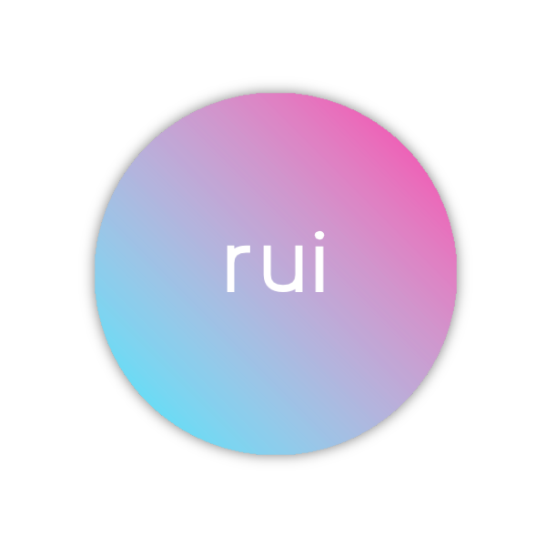
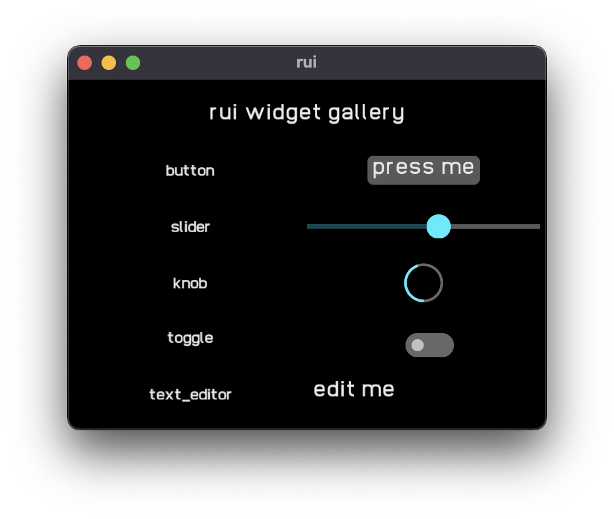

<p align="center">

</p>

# rui


[](https://deps.rs/repo/github/audulus/rui)

Experimental Rust UI library, inspired by SwiftUI. Early days, but some stuff already works. rui will be used for a future version of [Audulus](http://audulus.com/)

rui is GPU rendered and updates reactively (when your state changes). The focus of rui is to have the best ergonomics, and use the simplest possible implementation. As such, there is no retained view tree (DOM) or view diffing. Evertying is re-rendered when state changes, under the assumption that we can do that quickly.

[discord server](https://discord.gg/JCVVBU3sCN)

- macOS ✅ 
- Windows ✅
- Linux ✅ 
- iOS ✅ (see https://github.com/audulus/rui-ios)
- wasm (WIP)

## Examples

obligatory Counter (`cargo run --example counter`):

```rust
use rui::*;

fn main() {
    rui(state(
        || 1,
        |count, cx| {
            vstack((
                cx[count].padding(Auto),
                button("increment", move |cx| {
                    cx[count] += 1;
                })
                .padding(Auto),
            ))
        },
    ));
}
```


some shapes (`cargo run --example shapes`):

```rust
use rui::*;

fn main() {
    rui(vstack((
        circle()
            .color(RED_HIGHLIGHT)
            .padding(Auto),
        rectangle()
            .corner_radius(5.0)
            .color(AZURE_HIGHLIGHT)
            .padding(Auto)
    )));
}
```


canvas for gpu drawing (`cargo run --example canvas`):

```rust
use rui::*;

fn main() {
    rui(canvas(|_, rect, vger| {
        vger.translate(rect.center() - LocalPoint::zero());

        let paint = vger.linear_gradient(
            [-100.0, -100.0],
            [100.0, 100.0],
            AZURE_HIGHLIGHT,
            RED_HIGHLIGHT,
            0.0,
        );

        let radius = 100.0;
        vger.fill_circle(LocalPoint::zero(), radius, paint);
    }));
}
```


`slider` with `map` (`cargo run --example slider`):

```rust
use rui::*;

#[derive(Default)]
struct MyState {
    value: f32,
}

/// A slider with a value.
fn my_slider(s: impl Binding<f32>) -> impl View {
    with_ref(s, move |v| {
        vstack((
            v.to_string().font_size(10).padding(Auto),
            hslider(s).thumb_color(RED_HIGHLIGHT).padding(Auto),
        ))
    })
}

fn main() {
    rui(state(MyState::default, |state, cx| 
        map(
            cx[state].value,
            move |v, cx| cx[state].value = v,
            |s, _| my_slider(s),
        ),
    ));
}
```


widget gallery (`cargo run --example gallery`):



## Goals

- Encode UI in types to ensure stable identity.
- Optimize to reduce redraw.
- Use [vger-rs](https://github.com/audulus/vger-rs) for rendering.
- Minimal boilerplate.
- Good looking.
- No `unsafe`.
- Accessibility for assistive technologies.

## Optional Features

- `winit` - (*enabled by default*) use winit for windowing.
- Use `default-features = false` if you are embedding rui (see https://github.com/audulus/rui-ios).

## Why and how?

In the long term, I'd like to move [Audulus](http://audulus.com/) over to Rust. After looking at other available UI options, it seemed best to implement something resembling the existing immediate mode UI system I already have working in Audulus, but better.

I had been enjoying the ergonomics of SwiftUI, but SwiftUI simply can't handle big node graphs very well (we have tried https://github.com/audiokit/flow which required falling back to manual layout and rendering with the Canvas node, so we couldn't put custom UI within each node). What you find with SwiftUI (particularly when profiling) is that there's a lot of machinery dealing with the caching aspects of things. It's opaqe, scary (crashes on occasion, parts are implemented in C++ not Swift!), and can be rather slow. Often, it seems to be caching things thare are trivial to recompute in the first place.

Not so long ago, before programmable shaders, it was necessary to cache parts of a UI in textures (CoreAnimation for example does this) to get good performance. Now we have extremely fast GPUs and such caching is not necessary to achieve good performance. In fact if enough is animating, lots of texture caching can hinder performance, since the caches need to be updated so often. Plus, the textures consume a fair amount of memory, and when you have an unbounded node-graph like Audulus, that memory usage would be unbounded. And what resolution do you pick for those textures?

So rui starts from the assumption that 2D UI graphics (not general vector graphics!) are a trivial workload for a GPU. If you consider how advanced games are now, doing realtime path-tracing, this seems inuitively correct, but Audulus more-or-less proves it. So that means we can do away with the texture caching, and we really might not even need damage regions either. I'm also skeptical of the need for parallel encoding or caching parts of the scene for 2D UI graphics, since, again, it's just a trivial GPU workload.

Layout, on the other hand, can't easily be offloaded to GPU free-performance land. It's necessary to cache layout information and try not to recompute it all the time. So rui caches layout and only recomputes it when the state changes (unlike a typical immediate mode UI which computes layout on the fly and is constrained to very simple layouts). For Audulus, this isn't quite enough, since some view-local state will be changing all the time as things are animating (Audulus solves this by only recomputing layout when the central document state changes). Perhaps this is where proponents of DOM-ish things (some other OOP-ish tree of widgets) would jump in and make their case, but I'm skeptical that's really necessary. Think of what actually needs to be (re)computed: a layout box for each (ephemeral) View, does this really require a separate tree of objects? Time will tell!

## Status

- ✅ basic shapes: circle, rounded rectangle
- ✅ basic gestures: tap, drag
- ✅ hstack/vstack
- ✅ text
- ✅ padding
- ✅ offsets
- ✅ state
- ✅ zstack
- ✅ canvas (GPU vector graphics with vger)
- ✅ bindings
- ✅ list
- ✅ sliders
- ✅ knobs
- ✅ editable text (still a bit rough)
- ✅ any_view (view type erasure)
- ✅ layout feedback
- ✅ animation
- ✅ UI unit testing

## References

[Towards principled reactive UI](https://raphlinus.github.io/rust/druid/2020/09/25/principled-reactive-ui.html)

[Towards a unified theory of reactive UI](https://raphlinus.github.io/ui/druid/2019/11/22/reactive-ui.html)

[Flutter's Rendering Pipeline](https://www.youtube.com/watch?v=UUfXWzp0-DU)

[Static Types in SwiftUI](https://www.objc.io/blog/2019/11/05/static-types-in-swiftui/)

[How Layout Works in SwiftUI](https://www.hackingwithswift.com/books/ios-swiftui/how-layout-works-in-swiftui)

[Xilem: an architecture for UI in Rust](https://raphlinus.github.io/rust/gui/2022/05/07/ui-architecture.html)
